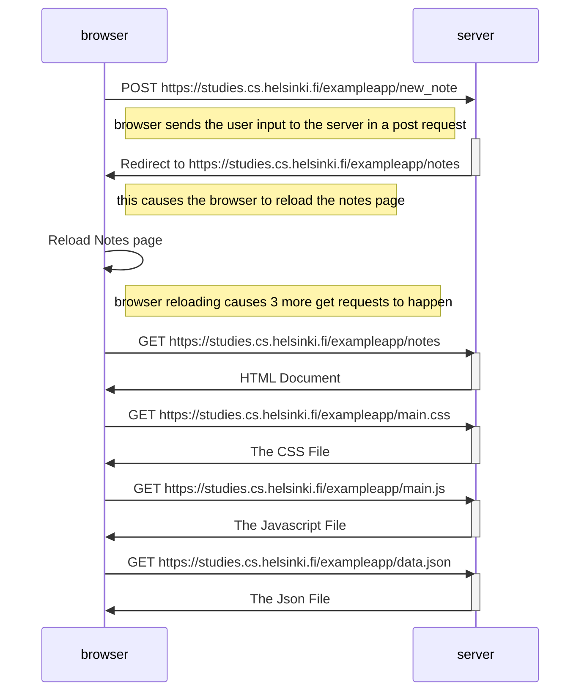

```mermaid
    sequenceDiagram
        participant browser
        participant server

        browser->>server: POST https://studies.cs.helsinki.fi/exampleapp/new_note
        Note right of browser: browser sends the user input to the server in a post request
        activate server
        server->>browser: Redirect to https://studies.cs.helsinki.fi/exampleapp/notes
        deactivate server

        Note right of browser: this causes the browser to reload the notes page

        browser->>browser: Reload Notes page

        Note right of browser: browser reloading causes 3 more get requests to happen

        browser->>server: GET https://studies.cs.helsinki.fi/exampleapp/notes
        activate server
        server->>browser: HTML Document
        deactivate server

        browser->>server: GET https://studies.cs.helsinki.fi/exampleapp/main.css
        activate server
        server->>browser: The CSS File
        deactivate server

        browser->>server: GET https://studies.cs.helsinki.fi/exampleapp/main.js
        activate server
        server->>browser: The Javascript File
        deactivate server

        browser->>server: GET https://studies.cs.helsinki.fi/exampleapp/data.json
        activate server
        server->>browser: The Json File
        deactivate server
```