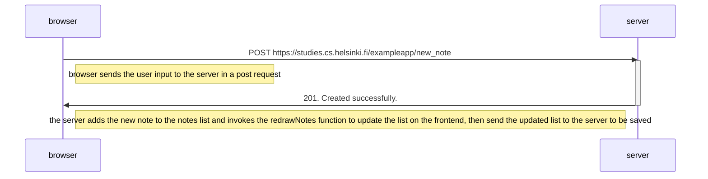

```mermaid
    sequenceDiagram
        participant browser
        participant server

        browser->>server: POST https://studies.cs.helsinki.fi/exampleapp/new_note
        activate server
        Note right of browser: browser sends the user input to the server in a post request
        server->>browser: 201. Created successfully.
        deactivate server
        Note right of browser: the server adds the new note to the notes list and invokes the redrawNotes function to update the list on the frontend, then send the updated list to the server to be saved
```